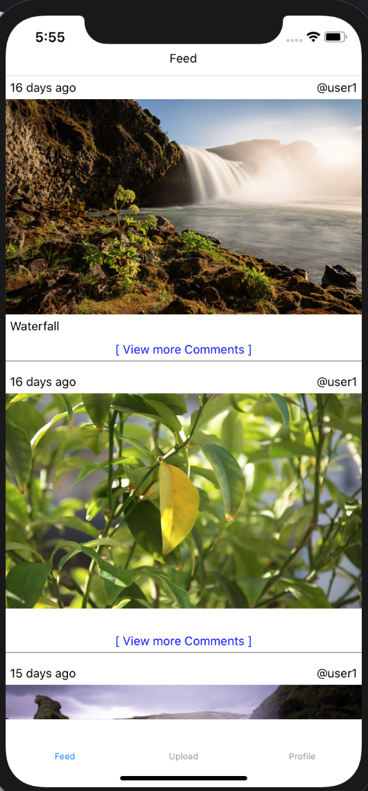

# PhotoSocialMedia
a PhotoSocialMedia mobile app inspired by Instagram

This app uses React Native, Firebase as backend for database, storage, and authentication.

This app have been still under development.
Comments Screen is being developed

Profile

Upload Page

Feed

